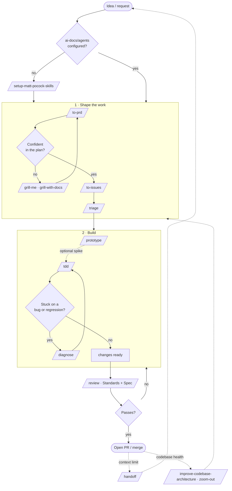

# ejajaro / ejaj

Monorepo for the `@ejaj` toolchain: `@ejaj/grove` (git-worktree lifecycle CLI, first tool),
with `@ejaj/core`, `@ejaj/cli`, and `@ejaj/maestro` stubbed for later. pnpm + TypeScript workspace.

---

## Agent skills

This repo ships [**mattpocock/skills**](https://github.com/mattpocock/skills) under `.claude/skills/`.
They are [Claude Code skills](https://docs.claude.com/en/docs/claude-code/skills) — invoke one by typing
`/<skill-name>` in Claude Code, or just describe your intent and Claude will route to the matching skill.

The engineering skills read repo-specific config from `ai-docs/agents/` (issue tracker, triage labels,
domain docs). Run **`setup-matt-pocock-skills`** once before first use if that config is missing — it
bootstraps the `## Agent skills` block and `ai-docs/agents/`.

### How to find out *when* to use a skill

Every skill is a single `SKILL.md` whose front-matter `description:` is the authoritative
"when to use this" trigger. Three ways to look it up:

1. **In Claude Code** — type `/` to list skills, or just say what you want ("review this branch",
   "grill me on this plan") and Claude matches the description.
2. **Read the source** — open `.claude/skills/<name>/SKILL.md`. The `description:` line is the trigger;
   the body is the procedure.
3. **Matt's canonical resources** — the upstream definitions, grouped by category. `skills-lock.json`
   pins each skill to its exact upstream path:
   - Repo: <https://github.com/mattpocock/skills>
   - Categories: [`engineering/`](https://github.com/mattpocock/skills/tree/main/skills/engineering),
     [`productivity/`](https://github.com/mattpocock/skills/tree/main/skills/productivity),
     [`deprecated/`](https://github.com/mattpocock/skills/tree/main/skills/deprecated)
   - Matt Pocock's writing/videos on agent skills: <https://www.aihero.dev> and
     [@mattpocockuk](https://github.com/mattpocock)

### Installed skills

#### Engineering — write & ship code

| Skill | Use it when… |
|-------|--------------|
| **`tdd`** | Building a feature or fixing a bug test-first (red → green → refactor), or you want integration tests. |
| **`diagnose`** | A hard bug or perf regression: reproduce → minimise → hypothesise → instrument → fix → regression-test. |
| **`prototype`** | You want a throwaway prototype to sanity-check a data model/state machine or mock up UI before committing. |
| **`improve-codebase-architecture`** | Finding refactoring/deepening opportunities, consolidating coupled modules, making code more testable. |
| **`zoom-out`** | You need higher-level context on how a section of code fits the bigger picture. |
| **`design-an-interface`** *(deprecated)* | Exploring several radically different API/module shapes in parallel ("design it twice"). |

#### Planning — turn ideas into tracked work

| Skill | Use it when… |
|-------|--------------|
| **`to-prd`** | Turning the current conversation into a PRD and publishing it to the issue tracker. |
| **`to-issues`** | Breaking a plan/spec/PRD into independently-grabbable issues (tracer-bullet vertical slices). |
| **`triage`** | Creating, triaging, or preparing issues for an AFK agent via the triage state machine. |
| **`request-refactor-plan`** *(deprecated)* | Planning a refactor as tiny safe commits, filed as a GitHub issue. |
| **`qa`** *(deprecated)* | Reporting bugs conversationally while the agent files GitHub issues. |

#### Stress-testing — sharpen a plan before you build

| Skill | Use it when… |
|-------|--------------|
| **`grill-me`** | You want to be interviewed relentlessly about a plan/design until every decision branch is resolved. |
| **`grill-with-docs`** | Same, but challenged against the domain model + ADRs, updating `CONTEXT.md`/ADRs inline. |

#### Productivity & meta

| Skill | Use it when… |
|-------|--------------|
| **`review`** | Reviewing changes since a commit/branch/tag along two axes — Standards and Spec — in parallel. |
| **`handoff`** | Compacting the current conversation into a handoff doc for another agent/session. |
| **`write-a-skill`** | Creating a new skill with proper structure and progressive disclosure. |
| **`setup-matt-pocock-skills`** | First-time setup of the repo config the engineering skills depend on. |

---

## Development flow

**Reading the flow**

1. **Setup** (once): `setup-matt-pocock-skills` wires up the repo config.
2. **Shape the work**: draft a PRD (`to-prd`), stress-test it (`grill-me` / `grill-with-docs`),
   then slice it into issues (`to-issues`) and order them (`triage`).
3. **Build**: optionally spike with `prototype`, then drive features test-first with `tdd`,
   dropping into `diagnose` whenever a bug or regression blocks you.
4. **Review & ship**: `review` checks the diff against repo Standards and the originating Spec
   before you open the PR.
5. **Cross-cutting**: `handoff` when you hit a context limit; `improve-codebase-architecture` and
   `zoom-out` to keep architecture healthy between cycles.

---

## Repo config the skills read

| File | Purpose |
|------|---------|
| `CLAUDE.md` | Project instructions + the `## Agent skills` block. |
| `ai-docs/agents/issue-tracker.md` | Issue tracker (GitHub Issues in `ejajaro/ejaj` via `gh`). |
| `ai-docs/agents/triage-labels.md` | Canonical 5-state triage vocabulary. |
| `ai-docs/agents/domain.md` | Domain doc layout (`CONTEXT.md`, `CONTEXT-MAP.md`, ADRs under `docs/adr/`). |
| `skills-lock.json` | Pins each installed skill to its exact upstream `mattpocock/skills` path + hash. |
